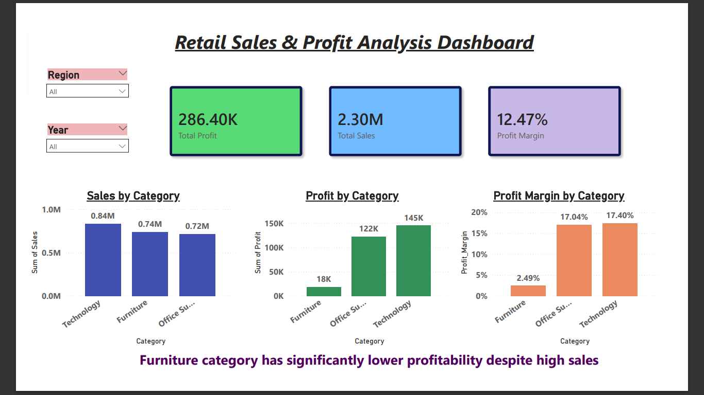
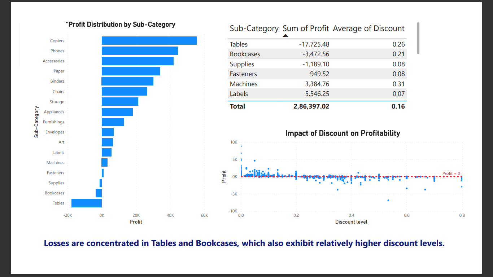
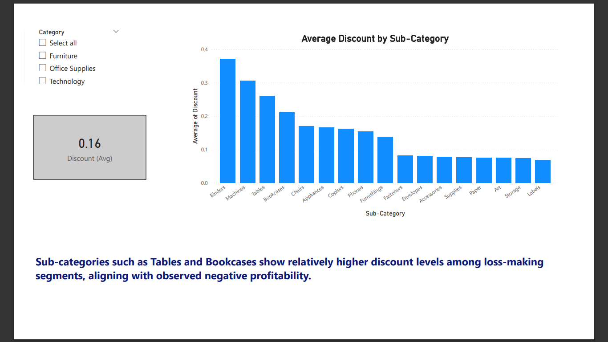

# Retail Sales & Profitability Analysis
End-to-end analysis of retail sales data using Python and Power BI to identify profitability drivers and discount-related losses

## Objective
Analyse retail sales data to identify profitability drivers and loss-making segments.

## Tools Used
- Python (Pandas, Matplotlib)
- Power BI
- DAX

## Dataset
Superstore dataset (~9800 records)

## Dashboard Preview

### Overview

### Profit Analysis

### Discount Analysis

## Key Insights
- Business is overall profitable (~286K profit)
- Technology drives most revenue and profit
- Furniture has a significantly lower profit margin
- High discount levels are associated with losses
- Tables and Bookcases are major loss-making sub-categories

## Conclusion
Excessive discounting is a key driver of losses. Optimising discount strategy and focusing on high-margin categories can improve profitability.

## Recommendations
- Reduce high discounts in Tables and Bookcases
- Focus on high-margin categories like Technology
- Review pricing strategy for low-margin products

